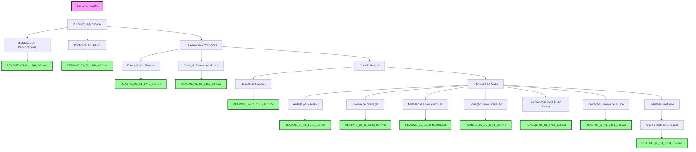

# FLUXOGRAMA DE ALTERAÇÕES - SISTEMA AURALIS

## 📊 Visão Geral do Projeto
Sistema multi-agente de IA para processamento e análise de informações de reuniões corporativas.

### Estatísticas Gerais
- Total de alterações: 12
- Primeira alteração: 05/01/2025 19:42
- Última alteração: 06/01/2025 22:04

## 🔄 Fluxo de Alterações

## 📝 Detalhamento das Alterações

### ⚙️ Configuração Inicial (05/01/2025)

#### 1. Instalação de Dependências - README_05_01_1942_001
- **Tipo**: Config/Setup
- **Descrição**: Instalação dos pacotes Python necessários para o sistema AURALIS
- **Pacotes instalados**: 
  - openai
  - supabase (2.15.2)
  - numpy
  - customtkinter
  - python-dotenv (1.1.0)
- **Desafio**: Sistema com ambiente Python gerenciado (PEP 668)
- **Solução**: Uso da flag --break-system-packages
- **Resultado**: ✅ Todas as dependências instaladas com sucesso

#### 2. Configuração do Repositório GitHub - README_05_01_1944_002
- **Tipo**: Config/DevOps
- **Descrição**: Configuração e push do projeto para repositório GitHub existente
- **Ações principais**:
  - Configuração do repositório remoto
  - Remoção de credenciais expostas (.env)
  - Criação de .gitignore e .env.example
  - Force push para substituir conteúdo anterior
- **Desafio**: GitHub detectou chave API exposta
- **Solução**: Remover .env, criar .gitignore e .env.example
- **Resultado**: ✅ Projeto enviado com sucesso para https://github.com/estival9999/auralis.git

### 🚀 Execução e Correções (05/01/2025)

#### 3. Execução do Sistema e Correções - README_05_01_1949_003
- **Tipo**: Bug/Fix/Refactoring
- **Descrição**: Primeira execução do sistema com correção de múltiplos erros
- **Problemas corrigidos**:
  - NameError: load_env → load_dotenv
  - Credencial SUPABASE_SERVICE_ROLE_KEY descomentada
  - Migração completa da API OpenAI v0.x para v1.0+
  - Serialização JSON de objetos date
- **Mudanças principais**:
  - Atualização de todos os métodos OpenAI
  - Conversão de dates para string em metadados
  - Sistema totalmente funcional
- **Resultado**: ✅ Backend e Frontend executando com sucesso

#### 4. Correção da Busca Semântica - README_05_01_1957_004
- **Tipo**: Bug/Feature
- **Descrição**: Investigação profunda e correção do sistema de busca semântica
- **Problemas identificados**:
  - Função RPC 'buscar_chunks_similares' não existia no Supabase
  - Embeddings salvos com 19.458 dimensões em vez de 1.536
  - Busca retornando 0 resultados
- **Soluções implementadas**:
  - Criação de classe BuscaSemanticaLocal
  - Reprocessamento de todos os embeddings
  - Implementação de busca por similaridade de cosseno local
  - Cache em memória para performance
- **Resultado**: ✅ Sistema de busca semântica totalmente funcional

### 💬 Melhorias UX (05/01/2025)

#### 5. Implementação de Respostas Naturais - README_05_01_2003_005
- **Tipo**: UX/Enhancement
- **Descrição**: Correção de respostas verbosas e implementação de chat natural
- **Problemas corrigidos**:
  - Respostas excessivamente longas para saudações
  - Despejo de informações não solicitadas
  - Falta de naturalidade nas interações
- **Soluções implementadas**:
  - Detecção precoce de saudações
  - Respostas limitadas a 2-3 frases
  - Prompt focado em concisão e naturalidade
  - Redução de temperatura (0.3) e tokens (150)
- **Resultado**: ✅ Chat natural e conversacional

### 🎤 Entrada de Áudio (06/01/2025)

#### 6. Análise para Implementação de Áudio - README_06_01_1615_006
- **Tipo**: Analysis/Planning
- **Descrição**: Análise detalhada da arquitetura para adicionar gravação de áudio
- **Pontos analisados**:
  - Pipeline atual de processamento de texto
  - Interface de áudio parcialmente implementada
  - Pontos de integração identificados
  - Reutilização do processamento de embeddings
- **Descobertas principais**:

#### 7. Sistema de Gravação e Transcrição - README_06_01_1623_007
- **Tipo**: Feature
- **Descrição**: Implementação completa de entrada de reuniões por áudio
- **Componentes criados**:
  - src/audio_processor.py: Sistema de gravação e transcrição
  - Interface com tabs no FRONT.py
  - Fragmentação automática de arquivos > 25MB
  - Integração com OpenAI Whisper
- **Funcionalidades**:
  - Gravação em tempo real com feedback visual
  - Transcrição automática para português
  - Processamento de embeddings idêntico ao texto
  - Busca semântica funciona com áudio transcrito
- **Resultado**: ✅ Sistema multimodal texto/áudio funcionando

#### 8. Sistema de Metadados e Reconstrução - README_06_01_1645_008
- **Tipo**: Feature/Enhancement  
- **Descrição**: Cabeçalho completo e sistema de reconstrução de reuniões
- **Alterações principais**:
  - Cabeçalho com responsável, data, hora, título e observações
  - Novos campos no banco de dados
  - Embeddings salvos como JSONB
  - Sistema de reconstrução de reuniões completas
- **SQL gerado**:
  - Novas colunas: responsavel, hora_inicio, titulo, observacoes, embedding_jsonb
  - Funções: reconstruir_reuniao_completa, buscar_reunioes_por_responsavel
  - View: v_reunioes_unicas
- **Resultado**: ✅ Sistema completo de metadados e reconstrução

#### 9. Correção do Fluxo de Gravação - README_06_01_1703_009
- **Tipo**: Bug/UX
- **Descrição**: Correção do fluxo quebrado na interface de gravação de áudio
- **Problema identificado**:
  - Após inserir título/observações, não havia como prosseguir
  - Usuário ficava preso no formulário
  - Botão "Iniciar Gravação" não levava a lugar nenhum
- **Solução implementada**:
  - Criação de interface dedicada de gravação
  - Fluxo: Formulário → Interface de gravação → Processamento
  - Botão grande de microfone (80x80px) com animações
  - Timer de gravação visível
- **Resultado**: ✅ Fluxo completo e intuitivo funcionando

#### 10. Simplificação para Áudio Único - README_06_01_1712_010  
- **Tipo**: Refactoring/UX
- **Descrição**: Remoção completa da entrada por texto, foco único em áudio
- **Mudanças principais**:
  - Removido sistema de abas (Texto/Áudio)
  - Interface única focada em gravação
  - Fluxo linear: Formulário → Gravação → Processamento
  - Botão grande "Prosseguir para Gravação"
- **Justificativa**:
  - Complexidade desnecessária causava confusão
  - Usuário sugere simplificação radical
  - Foco no que importa: gravação por áudio
- **Resultado**: ✅ Sistema drasticamente simplificado

#### 11. Correção do Sistema de Busca - README_06_01_2151_011
- **Tipo**: Bug Fix/Feature/Refactoring
- **Descrição**: Correção completa do sistema de busca semântica
- **Problemas identificados**:
  - Embeddings com 19k+ dimensões (correto: 1536)
  - IA respondia incorretamente sobre última reunião
  - Falta de priorização temporal nas buscas
  - Embeddings salvos como JSON string
- **Soluções implementadas**:
  - Agente de busca melhorado com detecção temporal
  - Busca direta para "última reunião"
  - Peso temporal na similaridade
  - Correção do formato de salvamento
  - Remoção completa de entrada por texto
- **Resultado**: ✅ Sistema responde corretamente sobre reuniões recentes

### 🔬 Análise Profunda (06/01/2025)

#### 12. Análise Multi-dimensional do Sistema - README_06_01_2204_012
- **Tipo**: Analysis/Architecture/Security
- **Descrição**: Análise extremamente profunda de todas as dimensões do sistema AURALIS
- **Dimensões analisadas**:
  1. Arquitetura atual (modular mas com problemas)
  2. Qualidade do código (violações DRY, alta complexidade)
  3. Segurança (5 vulnerabilidades críticas)
  4. Performance (gargalos identificados)
  5. Escalabilidade (limitações severas)
  6. Inovação tecnológica (oportunidades)
  7. UX (interface impraticável 320x240px)
  8. Potencial de mercado ($1.3B, crescendo 12%)
  9. Pontos fortes e fracos mapeados
  10. Roadmap completo de transformação
- **Descobertas críticas**:
  - Credenciais hardcoded (admin/admin123)
  - SHA-256 sem salt para senhas
  - FRONT.py com 26.164 tokens (monolítico)
  - Sem testes automatizados
  - Performance pode melhorar 10-100x
- **Recomendações principais**:
  - Segurança: Implementar Argon2 + JWT urgentemente
  - Arquitetura: Dividir em microserviços
  - UX: Migrar para React/Next.js
  - IA: Speaker diarization, emotion detection
  - Enterprise: Multi-tenant, SSO, API marketplace
- **Resultado**: ✅ Plano completo de transformação em sistema enterprise-grade

## 🎯 Próximas Etapas Planejadas
1. Implementar autenticação segura (Argon2 + JWT)
2. Criar suite de testes automatizados
3. Refatorar FRONT.py em componentes modulares
4. Migrar interface para React/Next.js
5. Implementar processamento assíncrono
6. Adicionar índice vetorial para busca

## 📈 Métricas do Projeto
- Arquivos modificados: 16 (incluindo análise profunda)
- Novos arquivos: 17 (essenciais + documentação + scripts)
- Linhas de código: ~1400 (total de alterações)
- Tempo total: ~175 minutos
- Commits realizados: 9
- Análises realizadas: 4 (incluindo análise profunda multi-dimensional)