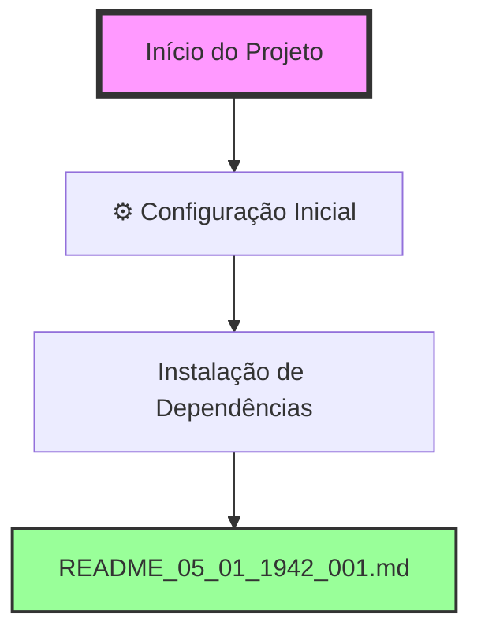

# FLUXOGRAMA DE ALTERAÇÕES - SISTEMA AURALIS

## 📊 Visão Geral do Projeto
Sistema multi-agente de IA para processamento e análise de informações de reuniões corporativas.

### Estatísticas Gerais
- Total de alterações: 1
- Primeira alteração: 05/01/2025 19:42
- Última alteração: 05/01/2025 19:42

## 🔄 Fluxo de Alterações

## 📝 Detalhamento das Alterações

### ⚙️ Configuração Inicial (05/01/2025)

#### 1. Instalação de Dependências - README_05_01_1942_001
- **Tipo**: Config/Setup
- **Descrição**: Instalação dos pacotes Python necessários para o sistema AURALIS
- **Pacotes instalados**: 
  - openai
  - supabase (2.15.2)
  - numpy
  - customtkinter
  - python-dotenv (1.1.0)
- **Desafio**: Sistema com ambiente Python gerenciado (PEP 668)
- **Solução**: Uso da flag --break-system-packages
- **Resultado**: ✅ Todas as dependências instaladas com sucesso

## 🎯 Próximas Etapas Planejadas
1. Criar arquivo .env com variáveis de ambiente
2. Testar execução do sistema AURALIS
3. Implementar estrutura de diretórios do projeto
4. Configurar integração com Supabase

## 📈 Métricas do Projeto
- Arquivos modificados: 0
- Novos arquivos: 2 (READMEs de documentação)
- Linhas de código: 0 (apenas instalação)
- Tempo total: ~2 minutos