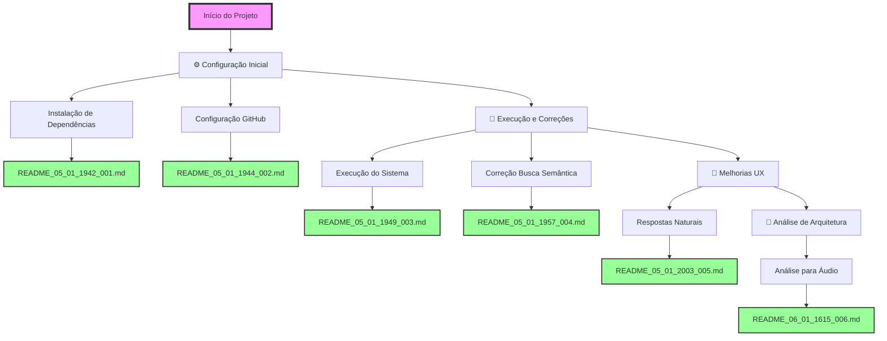

# FLUXOGRAMA DE ALTERAÇÕES - SISTEMA AURALIS

## 📊 Visão Geral do Projeto
Sistema multi-agente de IA para processamento e análise de informações de reuniões corporativas.

### Estatísticas Gerais
- Total de alterações: 6
- Primeira alteração: 05/01/2025 19:42
- Última alteração: 06/01/2025 16:15

## 🔄 Fluxo de Alterações

## 📝 Detalhamento das Alterações

### ⚙️ Configuração Inicial (05/01/2025)

#### 1. Instalação de Dependências - README_05_01_1942_001
- **Tipo**: Config/Setup
- **Descrição**: Instalação dos pacotes Python necessários para o sistema AURALIS
- **Pacotes instalados**: 
  - openai
  - supabase (2.15.2)
  - numpy
  - customtkinter
  - python-dotenv (1.1.0)
- **Desafio**: Sistema com ambiente Python gerenciado (PEP 668)
- **Solução**: Uso da flag --break-system-packages
- **Resultado**: ✅ Todas as dependências instaladas com sucesso

#### 2. Configuração do Repositório GitHub - README_05_01_1944_002
- **Tipo**: Config/DevOps
- **Descrição**: Configuração e push do projeto para repositório GitHub existente
- **Ações principais**:
  - Configuração do repositório remoto
  - Remoção de credenciais expostas (.env)
  - Criação de .gitignore e .env.example
  - Force push para substituir conteúdo anterior
- **Desafio**: GitHub detectou chave API exposta
- **Solução**: Remover .env, criar .gitignore e .env.example
- **Resultado**: ✅ Projeto enviado com sucesso para https://github.com/estival9999/auralis.git

### 🚀 Execução e Correções (05/01/2025)

#### 3. Execução do Sistema e Correções - README_05_01_1949_003
- **Tipo**: Bug/Fix/Refactoring
- **Descrição**: Primeira execução do sistema com correção de múltiplos erros
- **Problemas corrigidos**:
  - NameError: load_env → load_dotenv
  - Credencial SUPABASE_SERVICE_ROLE_KEY descomentada
  - Migração completa da API OpenAI v0.x para v1.0+
  - Serialização JSON de objetos date
- **Mudanças principais**:
  - Atualização de todos os métodos OpenAI
  - Conversão de dates para string em metadados
  - Sistema totalmente funcional
- **Resultado**: ✅ Backend e Frontend executando com sucesso

#### 4. Correção da Busca Semântica - README_05_01_1957_004
- **Tipo**: Bug/Feature
- **Descrição**: Investigação profunda e correção do sistema de busca semântica
- **Problemas identificados**:
  - Função RPC 'buscar_chunks_similares' não existia no Supabase
  - Embeddings salvos com 19.458 dimensões em vez de 1.536
  - Busca retornando 0 resultados
- **Soluções implementadas**:
  - Criação de classe BuscaSemanticaLocal
  - Reprocessamento de todos os embeddings
  - Implementação de busca por similaridade de cosseno local
  - Cache em memória para performance
- **Resultado**: ✅ Sistema de busca semântica totalmente funcional

### 💬 Melhorias UX (05/01/2025)

#### 5. Implementação de Respostas Naturais - README_05_01_2003_005
- **Tipo**: UX/Enhancement
- **Descrição**: Correção de respostas verbosas e implementação de chat natural
- **Problemas corrigidos**:
  - Respostas excessivamente longas para saudações
  - Despejo de informações não solicitadas
  - Falta de naturalidade nas interações
- **Soluções implementadas**:
  - Detecção precoce de saudações
  - Respostas limitadas a 2-3 frases
  - Prompt focado em concisão e naturalidade
  - Redução de temperatura (0.3) e tokens (150)
- **Resultado**: ✅ Chat natural e conversacional

### 🎤 Análise de Arquitetura (06/01/2025)

#### 6. Análise para Implementação de Áudio - README_06_01_1615_006
- **Tipo**: Analysis/Planning
- **Descrição**: Análise detalhada da arquitetura para adicionar gravação de áudio
- **Pontos analisados**:
  - Pipeline atual de processamento de texto
  - Interface de áudio parcialmente implementada
  - Pontos de integração identificados
  - Reutilização do processamento de embeddings
- **Descobertas principais**:
  - Interface de áudio já existe em FRONT.py (linhas 869-1083)
  - Sistema modular permite fácil extensão
  - Pipeline de embeddings totalmente reutilizável
  - Estados de gravação já implementados
- **Recomendações**:
  - Criar módulo audio_processor.py
  - Adicionar seleção de modo (áudio/texto)
  - Usar OpenAI Whisper para transcrição
  - Manter pipeline existente de embeddings
- **Resultado**: ✅ Arquitetura mapeada e pronta para implementação

## 🎯 Próximas Etapas Planejadas
1. Implementar gravação de áudio real com Whisper
2. Criar módulo audio_processor.py
3. Adicionar seleção de modo áudio/texto
4. Implementar memória de conversa
5. Adicionar mais conteúdo de reuniões
6. Criar função RPC no Supabase
7. Melhorar interface visual

## 📈 Métricas do Projeto
- Arquivos modificados: 9 (incluindo ajustes UX)
- Novos arquivos: 9 (essenciais + documentação)
- Linhas de código: ~600 (total de alterações)
- Tempo total: ~67 minutos
- Commits realizados: 5
- Análises realizadas: 1