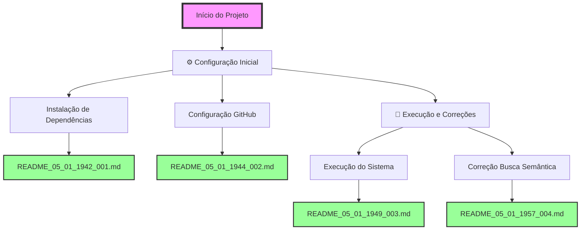

# FLUXOGRAMA DE ALTERAÇÕES - SISTEMA AURALIS

## 📊 Visão Geral do Projeto
Sistema multi-agente de IA para processamento e análise de informações de reuniões corporativas.

### Estatísticas Gerais
- Total de alterações: 4
- Primeira alteração: 05/01/2025 19:42
- Última alteração: 05/01/2025 19:57

## 🔄 Fluxo de Alterações

## 📝 Detalhamento das Alterações

### ⚙️ Configuração Inicial (05/01/2025)

#### 1. Instalação de Dependências - README_05_01_1942_001
- **Tipo**: Config/Setup
- **Descrição**: Instalação dos pacotes Python necessários para o sistema AURALIS
- **Pacotes instalados**: 
  - openai
  - supabase (2.15.2)
  - numpy
  - customtkinter
  - python-dotenv (1.1.0)
- **Desafio**: Sistema com ambiente Python gerenciado (PEP 668)
- **Solução**: Uso da flag --break-system-packages
- **Resultado**: ✅ Todas as dependências instaladas com sucesso

#### 2. Configuração do Repositório GitHub - README_05_01_1944_002
- **Tipo**: Config/DevOps
- **Descrição**: Configuração e push do projeto para repositório GitHub existente
- **Ações principais**:
  - Configuração do repositório remoto
  - Remoção de credenciais expostas (.env)
  - Criação de .gitignore e .env.example
  - Force push para substituir conteúdo anterior
- **Desafio**: GitHub detectou chave API exposta
- **Solução**: Remover .env, criar .gitignore e .env.example
- **Resultado**: ✅ Projeto enviado com sucesso para https://github.com/estival9999/auralis.git

### 🚀 Execução e Correções (05/01/2025)

#### 3. Execução do Sistema e Correções - README_05_01_1949_003
- **Tipo**: Bug/Fix/Refactoring
- **Descrição**: Primeira execução do sistema com correção de múltiplos erros
- **Problemas corrigidos**:
  - NameError: load_env → load_dotenv
  - Credencial SUPABASE_SERVICE_ROLE_KEY descomentada
  - Migração completa da API OpenAI v0.x para v1.0+
  - Serialização JSON de objetos date
- **Mudanças principais**:
  - Atualização de todos os métodos OpenAI
  - Conversão de dates para string em metadados
  - Sistema totalmente funcional
- **Resultado**: ✅ Backend e Frontend executando com sucesso

#### 4. Correção da Busca Semântica - README_05_01_1957_004
- **Tipo**: Bug/Feature
- **Descrição**: Investigação profunda e correção do sistema de busca semântica
- **Problemas identificados**:
  - Função RPC 'buscar_chunks_similares' não existia no Supabase
  - Embeddings salvos com 19.458 dimensões em vez de 1.536
  - Busca retornando 0 resultados
- **Soluções implementadas**:
  - Criação de classe BuscaSemanticaLocal
  - Reprocessamento de todos os embeddings
  - Implementação de busca por similaridade de cosseno local
  - Cache em memória para performance
- **Resultado**: ✅ Sistema de busca semântica totalmente funcional

## 🎯 Próximas Etapas Planejadas
1. Implementar função RPC no Supabase com pgvector
2. Adicionar mais conteúdo de reuniões
3. Melhorar interface do usuário
4. Implementar cache persistente

## 📈 Métricas do Projeto
- Arquivos modificados: 8 (incluindo novos arquivos de busca)
- Novos arquivos: 15+ (incluindo scripts de teste e debug)
- Linhas de código: ~500 (incluindo correções e novos módulos)
- Tempo total: ~37 minutos
- Commits realizados: 3