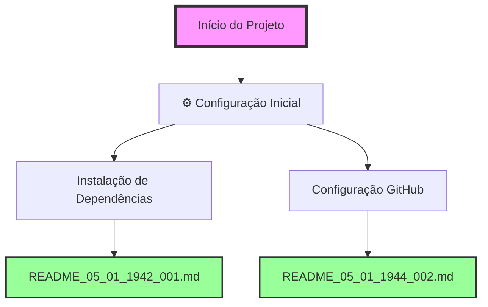

# FLUXOGRAMA DE ALTERAÇÕES - SISTEMA AURALIS

## 📊 Visão Geral do Projeto
Sistema multi-agente de IA para processamento e análise de informações de reuniões corporativas.

### Estatísticas Gerais
- Total de alterações: 2
- Primeira alteração: 05/01/2025 19:42
- Última alteração: 05/01/2025 19:44

## 🔄 Fluxo de Alterações

## 📝 Detalhamento das Alterações

### ⚙️ Configuração Inicial (05/01/2025)

#### 1. Instalação de Dependências - README_05_01_1942_001
- **Tipo**: Config/Setup
- **Descrição**: Instalação dos pacotes Python necessários para o sistema AURALIS
- **Pacotes instalados**: 
  - openai
  - supabase (2.15.2)
  - numpy
  - customtkinter
  - python-dotenv (1.1.0)
- **Desafio**: Sistema com ambiente Python gerenciado (PEP 668)
- **Solução**: Uso da flag --break-system-packages
- **Resultado**: ✅ Todas as dependências instaladas com sucesso

#### 2. Configuração do Repositório GitHub - README_05_01_1944_002
- **Tipo**: Config/DevOps
- **Descrição**: Configuração e push do projeto para repositório GitHub existente
- **Ações principais**:
  - Configuração do repositório remoto
  - Remoção de credenciais expostas (.env)
  - Criação de .gitignore e .env.example
  - Force push para substituir conteúdo anterior
- **Desafio**: GitHub detectou chave API exposta
- **Solução**: Remover .env, criar .gitignore e .env.example
- **Resultado**: ✅ Projeto enviado com sucesso para https://github.com/estival9999/auralis.git

## 🎯 Próximas Etapas Planejadas
1. Criar arquivo .env com variáveis de ambiente
2. Testar execução do sistema AURALIS
3. Implementar estrutura de diretórios do projeto
4. Configurar integração com Supabase

## 📈 Métricas do Projeto
- Arquivos modificados: 1 (FLUXOGRAMA.md)
- Novos arquivos: 6 (.gitignore, .env.example, 2 READMEs, FLUXOGRAMA.md)
- Linhas de código: ~50 (gitignore + env.example)
- Tempo total: ~7 minutos
- Commits realizados: 1 (inicial + amend)